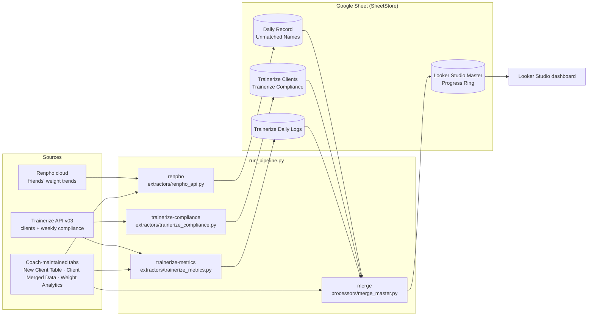

# HealthSync Engine


[](https://github.com/mohamd764/HealthSync-Engine/actions/workflows/ci.yml)

A Python ETL pipeline that combines client weigh-ins from **Renpho** smart scales with workout, habit and cardio compliance from **Trainerize**. It reconciles client names across the two systems and publishes one tidy table to **Google Sheets**, which a **Looker Studio** dashboard reads.

## Problem

Online fitness coaching programmes usually track clients in several disconnected tools:

- **Renpho**: clients weigh themselves on a smart scale, and the readings land in the Renpho app.
- **Trainerize**: coaches assign workouts, habits and cardio, and Trainerize records weekly compliance.
- **A Google Sheet** maintained by the coaches: target weight, programme start and end dates, and notes.

The same person can appear under different spellings in each tool (for example *Jon Carter*, *jon.carter* and *John Carter*). Neither vendor offers a combined view. Without a pipeline, coaches have to copy numbers by hand to see who is progressing and who is falling behind.

HealthSync Engine automates that consolidation. It produces one row per client per day, which a dashboard can filter by coach, client and date.

## Architecture



Every step reads and writes named tabs through a small `SheetStore` interface (`src/utils/sheets_connector.py`). `GoogleSheetStore` is used for real runs. `LocalCsvStore` writes one CSV per tab, which lets `--dry-run` and the tests run the same code offline.

| Path | Responsibility |
| --- | --- |
| `run_pipeline.py` | CLI entry point. Loads config, builds the stores and API clients, and runs the selected steps in order. |
| `src/config.py` | Reads every setting from environment variables or `.env`, and checks that the selected steps have what they need. |
| `src/extractors/renpho_api.py` | Logs in to Renpho, lists the coach account's friends, fetches each friend's weight history and maps it to a client ID. |
| `src/extractors/trainerize_client.py` | Minimal Trainerize v03 client (Basic auth, pagination). |
| `src/extractors/trainerize_compliance.py` | Active client list plus the last 4 weeks of compliance. |
| `src/extractors/trainerize_metrics.py` | Expands weekly compliance into daily rows and adds target weight and coach. |
| `src/processors/merge_master.py` | `build_master()`: a pure function that merges all sources, resolves names and computes weight-progress fields. |
| `src/utils/client_mapping.py` | Maps Renpho names to the client table (exact App ID, then exact name, then `difflib` fuzzy match). |
| `src/demo.py` | Fictional clients and fake Renpho/Trainerize sources, used by `--dry-run` and the tests. |

## Data flow

1. **Renpho to `Daily Record`.** One Renpho account adds every client as a "friend". For each friend, the pipeline fetches the full weight trend and matches the account name against the `New Client Table` (columns `Client ID | Client Name | App ID`). It writes `Client ID | Client Name | Date (dd/mm/yy) | Value`. Friends with no match get ID `0` and are listed in `Unmatched Names`, so a coach can fix the mapping.
2. **Trainerize to `Trainerize Clients` and `Trainerize Compliance`.** This step fetches all active clients, including their assigned coach, plus weekly scheduled and completed counts for workouts, habits and nutrition over the last 4 weeks.
3. **Trainerize to `Trainerize Daily Logs`.** This step fetches up to 730 days of weekly compliance per client in one API call per client. It expands the data into one row per day with cardio, workout, habit and overall compliance percentages. Target weight comes from `Weight Analytics` and the coach from Trainerize, falling back to the `New Client Table`.
4. **Merge to `Looker Studio Master` and `Progress Ring`.** Daily records are merged per client and date in priority order: Trainerize first, then `Daily Record - Main` (a legacy tab, if present), then `Daily Record`. Names are reconciled with substring, normalised and word-overlap matching. Weights outside 30–250 kg are discarded. Starting, latest and target weight produce `Weight Loss`, `Total To Lose` and `Progress Percent`. Clients with no daily data still get one summary row, so they appear in dashboard filters.
5. **Looker Studio.** Connect `Looker Studio Master` (time series) and `Progress Ring` (one progress value per client) as Google Sheets data sources.

## Setup

### Requirements

- Python 3.11+
- A Google Cloud service account with the Sheets and Drive APIs enabled. Share the target sheet with the service account's `client_email` as an editor.
- A Trainerize account with API access (group ID and API token).
- A Renpho account that has the clients added as friends.

### Install

```bash
git clone https://github.com/mohamd764/HealthSync-Engine.git
cd HealthSync-Engine
python -m venv .venv && source .venv/bin/activate   # Windows: .venv\Scripts\activate
pip install -r requirements-dev.txt
```

### Try it without credentials

```bash
python run_pipeline.py --dry-run
```

This runs all four steps against built-in **fictional** data and writes every tab as a CSV under `output/sheets/`, including `looker_studio_master.csv`. No network access or credentials are needed.

### Configure a real run

```bash
cp .env.example .env        # then edit .env
```

| Variable | Required for | Description |
| --- | --- | --- |
| `RENPHO_EMAIL`, `RENPHO_PASSWORD` | `renpho` | Renpho account that holds the client friend list |
| `TZ_GROUP_ID`, `TZ_API_TOKEN` | `trainerize-*` | Trainerize API credentials |
| `GOOGLE_SHEET_ID` | all steps | Target spreadsheet ID |
| `GOOGLE_CREDENTIALS_JSON` | all steps | Path to the service-account key file (default `credentials.json`) |
| `MERGER_SHEET_ID` | optional | Spreadsheet holding `Client Merged Data`, if different from `GOOGLE_SHEET_ID` |
| `CLIENT_FILTER` | optional | Only process Trainerize clients whose name contains this text |
| `OUTPUT_DIR` | optional | Local output directory (default `output/`) |

`.env`, service-account keys and `output/` are git-ignored. Never commit them.

The sheet must contain the tabs that coaches maintain by hand: `New Client Table` (client ID in column A, name in B, Renpho App ID in C, coach in N), `Client Merged Data` and `Weight Analytics`. The pipeline creates every other tab.

### Run

```bash
python run_pipeline.py                                  # all steps
python run_pipeline.py --steps trainerize-metrics,merge # a subset
python run_pipeline.py -v                               # debug logging
```

The exit code is `0` on success, `1` if a step fails and `2` if configuration is missing. That makes it suitable for cron or a scheduled task.

### Tests

```bash
pytest -q
```

The tests cover name matching, Renpho response parsing, the merge and progress calculations, config validation, and a full dry run. CI runs them on Python 3.11 and 3.12.

## Limitations

- **Unofficial Renpho access.** Renpho has no public API. Login and encryption come from the community [`renpho-api`](https://pypi.org/project/renpho-api/) package, and the friend endpoints are undocumented app endpoints. They can break at any time, and using them may conflict with Renpho's terms of service.
- **No Trainerize body stats.** Per-day body stats need one API call per client per day and hit rate limits. The weight, waist, body-fat, BMI and resting-HR columns in `Trainerize Daily Logs` are therefore empty, and weight comes from Renpho.
- **Heuristic name matching.** Fuzzy matching can produce false positives or misses. Unmatched Renpho friends are reported, but word-overlap matches in the merge step are not, so review new clients.
- **Full refresh.** Each run clears and rewrites its output tabs. There is no incremental load, history table or retry/backoff beyond simple request delays.
- **Weekly granularity.** Trainerize compliance is weekly, so the daily rows repeat the week's values.
- **Sheet layout assumptions.** Some columns are read by position, for example the coach in column N of `New Client Table` and the Renpho tabs.
- **Sensitive data.** Outputs contain client names, emails, body weight and optional medication and coach notes (the `Medical Notes` column). Restrict sheet sharing to named accounts, keep the service-account key private and follow the privacy obligations that apply to your clients' health data.

## License

[MIT](LICENSE)
